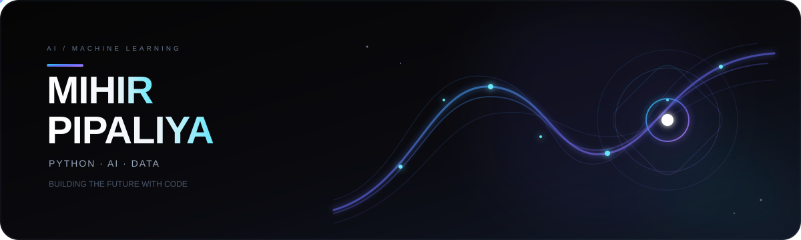

 

### 🤖 AI/ML Enthusiast • 🐍 Python Developer • 📊 Data Science Learner

 

&nbsp;

&nbsp;

---

## 🧑‍💻 About Me

🎓 **BCA Graduate** passionate about **Artificial Intelligence, Machine Learning & Data Science**

🐍 Building with **Python, NumPy, Pandas, Scikit-learn & TensorFlow**

🤖 Exploring **Machine Learning, Deep Learning, NLP & Transformers**

📊 Interested in **Data Analysis, Predictive Modeling & Real-World AI Applications**

💻 Also experienced with **React, FastAPI, PostgreSQL & MySQL**

🚀 Focused on **building projects, improving problem-solving skills & learning new AI technologies**

 

---

## 🛠️ Tech Stack

### 🐍 Data & AI

<table align="center">
<tr align="center">

<td width="120">
 
<b>Python</b>
</td>

<td width="120">
 
<b>NumPy</b>
</td>

<td width="120">
 
<b>Pandas</b>
</td>

<td width="120">
 
<b>Scikit-learn</b>
</td>

<td width="120">
 
<b>TensorFlow</b>
</td>

</tr>
</table>

 

### 🌐 Development

<table align="center">
<tr align="center">

<td width="120">
 
<b>React</b>
</td>

<td width="120">
 
<b>FastAPI</b>
</td>

<td width="120">
 
<b>PostgreSQL</b>
</td>

<td width="120">
 
<b>MySQL</b>
</td>

<td width="120">
 
<b>Git</b>
</td>

</tr>
</table>

---

## 🧠 Learning Journey

**Python** → **Data Analysis** → **Machine Learning** → **Deep Learning**

→ **NLP** → **Transformers** → **AI Applications**

  

`Python` `NumPy` `Pandas` `Scikit-learn` `TensorFlow` `SQL` `DSA`

---

## 🚀 Featured Projects

|         Project        |             Stack            |            Description            |
| :--------------------: | :--------------------------: | :-------------------------------: |
|      🍔 **CRAVE**      | React · FastAPI · PostgreSQL | Full-stack food delivery platform |
| 🎓 **Mark Prediction** |     Python · Scikit-learn    |   Student performance prediction  |
|  📊 **Sales Analysis** |      Pandas · Matplotlib     |   Sales & business data analysis  |
| 🧠 **LSTM Prediction** |       TensorFlow · LSTM      |        Next-word prediction       |

---

## 📊 GitHub Activity

<!-- GitHub Activity Badges -->

&nbsp;

&nbsp;

  

### 🔥 Contribution Calendar

  

### ⚡ Streak & Consistency

---

## 🎯 Current Focus

`Machine Learning` · `Deep Learning` · `Agentic AI` · `SQL` · `DSA`

---

### 🤖 Build AI. Solve Problems. Keep Growing.

⭐ **Explore my repositories and follow my journey!**

 

